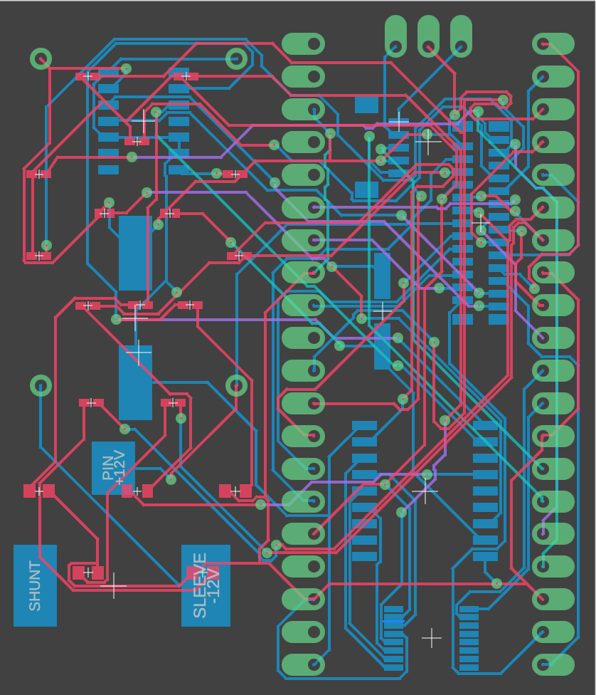

# Introduction

I tried to get my previous CAN-bus adapter design working,
but I'm thinking the chip(s) got fried in all my touching
and working with them..

But also that I'm loosing four pins for that, and I have
use for them at some point later (have a few vague ideas :).

So I decided to redisign it from scratch, this time base it
on Konstantins original design.

However, I²C was quite easy to work with for the UPS, so
why not use it for that as well!? The I²C bus speed is
between 100kbps and 400kbps, and the CAN bus in the MB
is 125kbps, so should be more than enough.

However, I'm going to need another set of eyes on this one,
I'm not an electronics engineer :).

But here it is anyway. Looks good on paper, we'll see how
it turns out.

If it does, I'll merge it into the main README.

## Circuit Diagrams and PCB

This is a bigger picture of just the CAN bus.

I also decided to cleanup the routing a little, it got QUITE
cramped and looked very .. "busy" :). So went for a 4-layer
PCB. Looks a little cleaner, and there's a lot less manual
(re)routing needed.

Oh, and I also changed the Pico to be a "Through Hole". Don't
think it's wise to solder that one as an SMB! I can, but you
never know if/when I have to change the design, which would
make it difficult to remove it. Better use pins for it, it's
easy enough to change to an SMB if/when it's stable enough.

The render do look *seriously* nice! The different LEDs are
now located on the top layer.

Three new ones: TX/RX/ERR for the CAN communication.

# Design

I got a little help from the Google AI, and from that I could get
this information.

## Pin-to-Pin Connection Mapping

|..| MCU	| Function		|..| SC18IS606	| Function		|..| MCP2515	| Function		|..| TJA1055		| Function		|..|
|:-| :---	| :---			|:-| :---       | :---                  |:-| :---	| :---			|:-| :---		| :---			|:-|
|> | SDA	| I²C-bus data		|> | SDA	| I²C-bus data		|  |		|			|  |			|			|  |
|> | SCL	| I²C-bus clock		|> | SCL	| I²C-bus clock		|  |		|			|  |			|			|  |
|  |		|			|  | MOSI	| SPI Master Out	|> | SI (MOSI)	| Data to MCP2515	|  | 			|			|  |
|  |		|			|  | MISO	| SPI Master In		|> | SO (MISO)	| Data from MCP2515	|  |			|			|  |
|  |		|			|  | SCK	| SPI Clock  		|> | SCK	| Clock Signal		|  |			|			|  |
|  |		|			|  | SS0/GPIO0	| Slave Select 0	|> | CS		| Active Low Select	|  |			|			|  |
|  | 3V3 OUT	| 			|> | VDD+VREFP	| +3.3V			|  | VDD	| +5V			|> | VCC+BAT+STB+EN	| +5V			|  |
|  |		|			|  | GND+VSS	| Common Ground		|> | GND	| Common Ground		|> | GND		| Common Ground		|  |
|  |		|			|  | RESET	| 10kΩ to VDD		|  |		|			|  |			|			|  |
|  |		|			|  | INT	| ??			|  |		|			|  |			|			|  |
|  |		|			|  |		|			|  | TXCAN	| Transmit CAN		|> | TXD		| Transmit Data IN	|  |
|  |		|			|  |		|			|  | RXCAN	| Receive CAN		|> | RXD		| Receive Data OUT	|  |
|  |		|			|  |		|			|  | OSC1	| Oscillator IN		|  |			|			|  |
|  |		|			|  |		|			|  | OSC2	| Oscillator OUT	|  |			|			|  |
|  |		|			|  |		|			|  |		|			|  | WAKE		| 1kΩ to GND		|  |
|  |		|			|  |		|			|  |		|			|  | CAN-L		| CAN OUT - LOW		| >|
|  |		|			|  |		|			|  |		|			|  | CAN-H		| CAN OUT - HIGH	| >|

### Detailed Setup Notes
* Chip Select (SS0): Connect the SS0 pin of the SC18IS606 to the CS
  pin of the MCP2515. The SC18IS606 supports up to three independent
  SPI slave devices.
* Voltage Levels: The SC18IS606 operates between 1.71V and 3.6V, but
  its I/O pins are 5V tolerant. If using a 5V MCP2515 module, ensure
  the SC18IS606 VCC is at 3.3V, but it can safely communicate with 5V
  logic.
* I2C Address (A0, A1, A2): These pins define the I2C address of the
  SC18IS606. Tie them to GND or VCC to set the 7-bit address.
* Interrupt (INT): Optionally, connect the INT pin of the MCP2515 to a
  GPIO of the host microcontroller or an interrupt pin on the
  SC18IS606 (if configured) to handle CAN messages efficiently.
* CAN Bus Connection: Ensure a 120-ohm termination resistor is
  connected across CANH and CANL if the module is at the end of the
  CAN network.

### SC18IS606 Command Flow
* the host microcontroller sends commands via I2C to the SC18IS606 to
  configure the SPI bridge,
* then writes to the SC18IS606 data buffer (1024 bytes) to initiate
  SPI transactions.

For example, to read an MCP2515 register, the host sends a 0x03
command (Read) followed by the address to the SC18IS606 via I2C.
